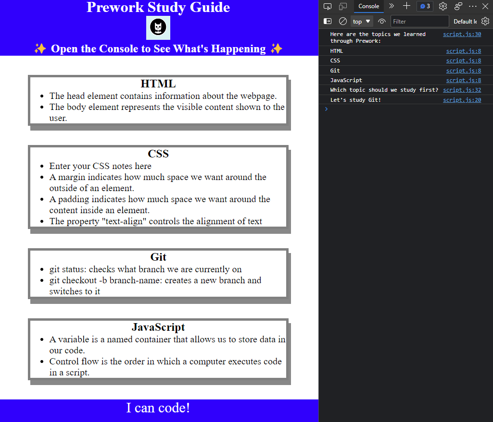

# Prework Study Guide Webpage

## Description

Provide a short description explaining the what, why, and how of your project. Use the following questions as a guide:

- To understand the basic structure of a webpage
- To understand the importance of CSS
- To understand how javascript can be integrated into a webpage and provide logic.

## Installation

N/A

## Preview

## Credits

N/A

## License

MIT License

## Features

* Ability to add items studied
* Use console log to view additional information.

## Tests

Go the extra mile and write tests for your application. Then provide examples on how to run them here.